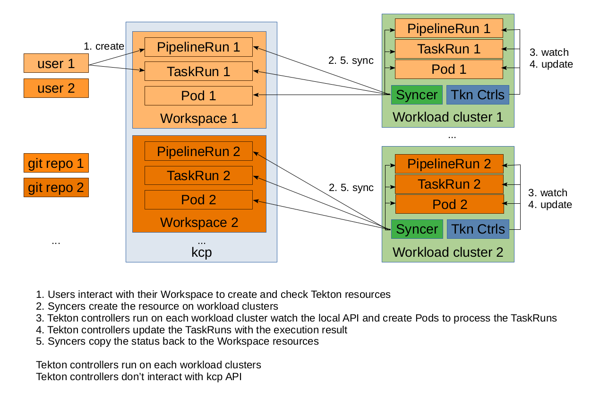
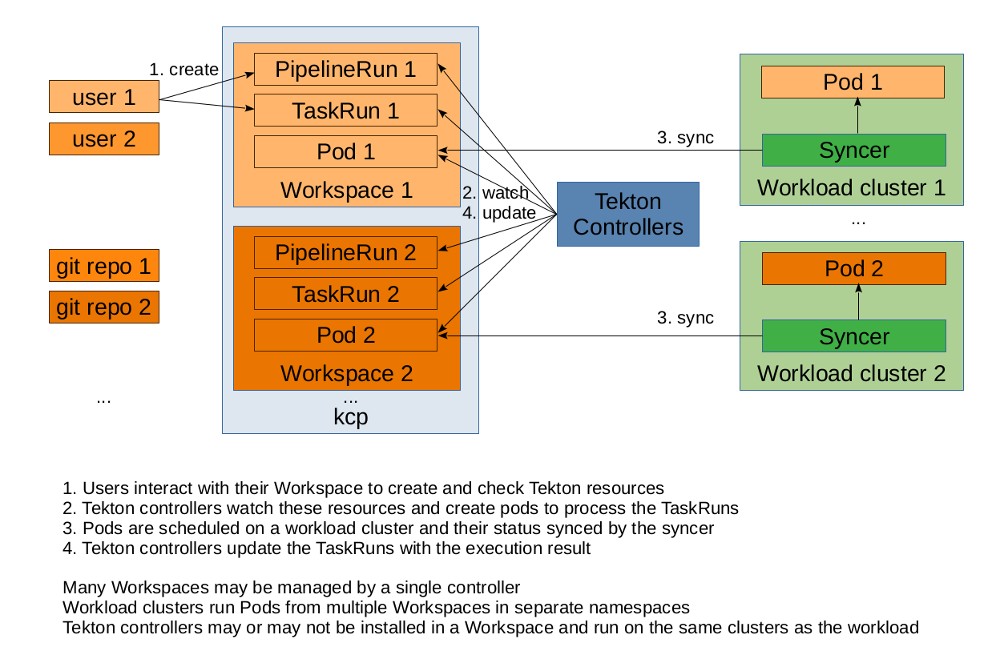

# Pipelines-service

Pipelines-service provides a SaaS for pipelines. It leverages Kubernetes, Tekton, Tekton Triggers, Tekton Results, Pipelines as Code together with kcp.

## Why Pipelines-service?

Tekton and Kubernetes provide a great infrastructure for build pipelines. They come however with some limitations.

- Multi-tenancy: Kubernetes provides a level of multi-tenancy. CustomResourceDefinitions are however cluster scoped. This induces a coupling between the operator version provided by the platform and what you can use as a tenant. The control plane is also shared between tenants.
- Scalability: Kubernetes has made easy to distribute load onto many servers and scalability at cloud scale more approachable. Like everything its controle plane has however its limits.
- Availability and geo-redundancy: Kubernetes control plane is based on an etcd cluster, which is sensible to latency between its members. This restricts what can be done in term of geographical distribution.

kcp helps with mitigating these challenges, pushing the limits to new horizons.

Pipelines as Code is the veneer that brings to the users a great exprience directly from their git repository.

## Design

### Phase 1

In the first phase Pipelines-service will leverage kcp Transparent-Multi-Cluster capabilities. Tekton and other controllers run directly on Kubernetes workload clusters and process the resources there. kcp syncer ensures that resources (Pipelines, PipelineRuns, etc.) created by users in their workspace are synced onto a workload cluster and the result of the processing reflected back to the user workspace.

This approach has the great advantage of not requiring any change to the controllers.

Controllers know nothing about kcp.

**Demo** (5mns)

### Phase 2

In the second phase the controllers used by Pipelines-service are made kcp-aware. This eliminates the need to sync the pipeline resources onto workload clusters and to have operators directly bound to any kubernetes cluster.
This brings additional benefits:
- not being tied up to a version of pipeline CRDs installed on a Kubernetes cluster
- being able to scale controllers and to distribute their load independently from the Kubernetes clusters
- flexibility in setting up failure domains

Tekton resource schemas are added only in kcp.
 
Kubernetes workload clusters know nothing about Tekton. They only run resources like Deployments, Pods and Services.

## How do I start?

### Running in Kubernetes or OpenShift

You can deploy this PoC to your Kubernetes cluster with the `build.sh` and `run.sh` scripts in `ckcp` folder.

More info [here](https://github.com/openshift-pipelines/pipelines-service/tree/main/ckcp)

## Running locally (deprecated)

Requires to install [kind](https://github.com/kubernetes-sigs/kind) and [ko](https://github.com/google/ko).
`KO_DOCKER_REPO` environment variable has to be set and system has to be logged in the registry.

The script `run.sh` in `local` directory works both on macOS (with Docker Desktop) and Linux.

### Fedora 35 Notes

Running with podman using rootless, requires to configure the environment for kind - https://kind.sigs.k8s.io/docs/user/rootless/

`short-names-mode` should be set to `permissive` in /etc/containers/registries.conf

### Hacks for vanilla Tekton

1. All Tekton v1alpha1 CRDs are installed on KCP

Tekton controller requires all of them to be installed to work.

Future: when graduating to v1, Tekton will drop these APIs

2. KCP version needs to be set

Tekton pipeline controller checks the version of the apiserver. It needs to satisfy a particular regexp.
The default value doesn't work.

Future: KCP will have a proper version set.

3. TaskRun logs are not available

Future: Pod will be a first-class citizen of KCP?

### Hacks for Tekton Triggers

1. Tekton CRDs must not contain `conversion` in their definition.

EventListener, when it calls KCP API, triggers a ConversionReview if this field is present.
KCP panics if it receives this.

Future: A solution is provided to avoid to bring them to KCP.
It is probably a bug in knative. The conversion should not be required if the good type version is used.

2. Service Account for Event Listener and Interceptor is handled manually

Triggers controller manages EL deployments. It uses service accounts for EL to call back apiserver. 
This doesn't work currently with KCP. 

Future: Service accounts will be copied to physical cluster somehow. This is needed for operators anyway.

3. Port forwarding only works on the physical cluster (only needed for testing)

Future: Pod will be a first-class citizen of KCP?
