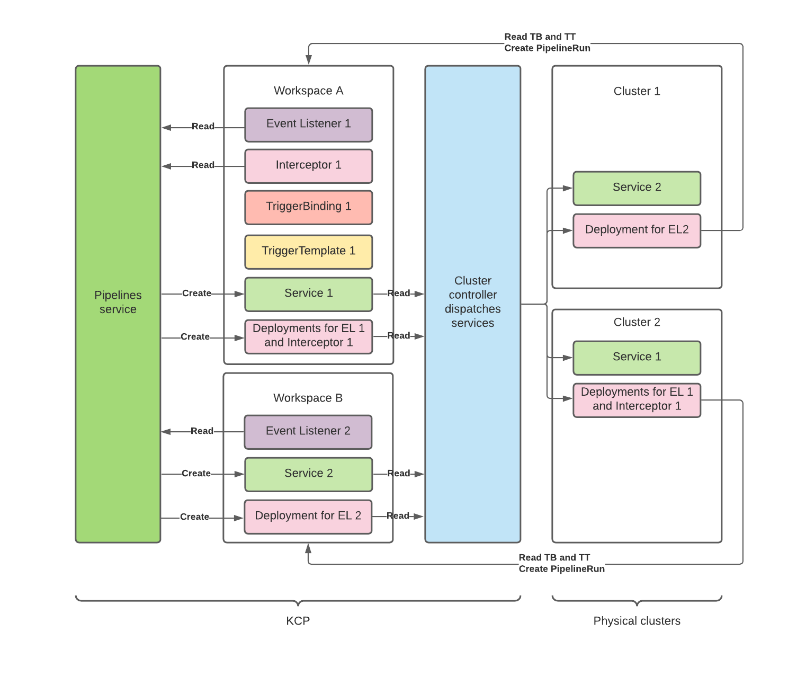

# Pipelines-service

Running Tekton and friends on top of KCP!

## Design

Tekton CRDs are added only in KCP. 
Physical clusters know nothing about Tekton. They only run Deployments, Pods and Services.

## Run
Requires to install [kind](https://github.com/kubernetes-sigs/kind) and [ko](https://github.com/google/ko).
`KO_DOCKER_REPO` environment variable has to be set and system has to be logged in the registry.

The script `run.sh` is tailored for macOS with Docker Desktop.

The Tekton Triggers part works because Docker Desktop allows containers to call services on the host with `host.docker.internal`.
Please update the script to the correct DNS name on your system.

### Fedora 35 Notes
Running with podman using, requires configure environment for kind - https://kind.sigs.k8s.io/docs/user/rootless/

`short-names-mode` should be set to `permissive` in /etc/containers/registries.conf

## Hacks for vanilla Tekton

1. All Tekton v1alpha1 CRDs are installed on KCP

Tekton controller requires all of them to be installed to work.

Future: when graduating to v1, Tekton will drop these APIs

2. Disable injected sidecar feature in Tekton

By default, Tekton TaskRun controller creates pods that wait for a particular annotation before starting.
This annotation is added by the controller once all init containers have run. 

This annotation is not propagated by the KCP syncer, maybe something to change. A quick fix is to disable this feature.

Future: KCP syncer will handle this and propagate new annotations.

3. KCP version needs to be set

Tekton pipeline controller checks the version of the apiserver. It needs to satisfy a particular regexp.
The default value doesn't work.

Future: KCP will have a proper version set.

4. TaskRun logs are not available

Future: Pod will be a first-class citizen of KCP?

## Hacks for Tekton Triggers

1. Tekton CRDs must not contain `conversion` in their definition.

EventListener, when it calls KCP API, triggers a ConversionReview if this field is present.
KCP panics if it receives this.

Future: A solution is provided to avoid to bring them to KCP.
It is probably a bug in knative. The conversion should not be required if the good type version is used.

2. Service Account for Event Listener and Interceptor is handled manually

Triggers controller manages EL deployments. It uses service accounts for EL to call back apiserver. 
This doesn't work currently with KCP. 

Future: Service accounts will be copied to physical cluster somehow. This is needed for operators anyway.

3. Port forwarding only works on the physical cluster (only needed for testing)

Future: Pod will be a first-class citizen of KCP?
