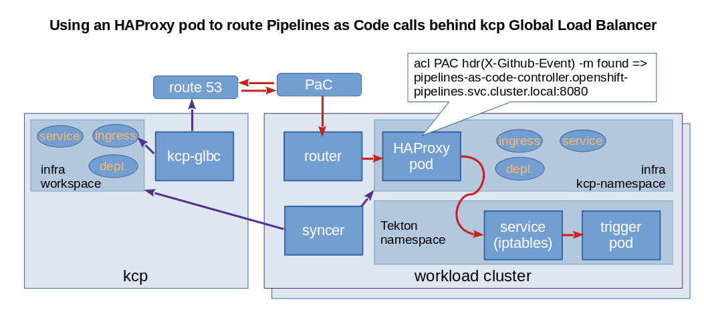

# Gateway for Pipelines as Code

Leveraging kcp, workload clusters are an infrastructure that is abstracted from end users. Depending on circumstances their pipelines may get scheduled on one or another cluster.
With the approach described for [phase 1](./phase1.md) controllers are directly running on these workload clusters.

This introduces a challenge. For trigger integration, external systems or users need to send requests to the listeners on the workload cluster.
The approach taken for addressing it is to use [kcp-glbc](https://github.com/Kuadrant/kcp-glbc) and to introduce a gateway (an HAProxy container) that forwards the requests to the Pipelines as Code listener deployed on the workload cluster.

## Architecture



- [kcp Global Load Balancer](https://github.com/Kuadrant/kcp-glbc). The current version automatically configures DNS, starting with route 53, so that the hostname generated for the ingress created by a user points to the IP address of the ingress router running on the cluster where the matching workload (Service, Deployment) has been deployed. The ingress resource gets then updated with the details. It also integrates with cert-manager to configure a certificate that matches the hostname.
- Ingress, Service, Deployment and ConfigMap for the HAProxy based gateway are created in kcp. The syncer copy them onto the workload clusters.

The request flow is as follows:

1. An external system, GitHub for instance, triggers an http call to the hostname generated by kcp-glbc.
2. The DNS server (route 53) returns the IP address for the ingress router running on the same workload cluster as the gateway.
3. The ingress router forwards the call to its backend, the gateway (HAProxy pod).
4. HAProxy uses path-based routing to forward `/pac` requests to the Pipelines as Code Service.
5. The Service, implemented through iptables rules or a cloud provider's load balancer most of the time, forwards the packets to the listener of Pipeline as Code.
6. Pipeline as Code processes the request.

## Design considerations

In phase 1 the listener for Pipeline As Code gets deployed directly on a compute cluster. As a consequence its namespace is unknown to any kcp workspace.
On the other hand we need to create an ingress in kcp so that it gets processed by kcp-glbc and a DNS entry gets created in AWS route 53. Note that kcp-glbc also aims at updating this entry when the workload gets scheduled to a different compute cluster due to maintenance or other reasons.
This ingress needs to reference a service in the same namespace. Two approaches have been ruled out:
- Services of type ExternalNames cannot be exposed with OpenShift router and only with the proprietary version of the NGinx router.
- Using external services in kcp infra namespace where the endpoints are manually defined to point to the PaC listener. IPs specified in Endpoints cannot be part of the service or pod ranges.

Note that the restrictions above have some multi-tenancy, security background.

This induces the need to have a component deployed in a kcp workspace, which does the routing to the listener for Pipeline As Code available in a different namespace. This is the job of the gateway (the HAProxy pod).
The gateway resources (deployment, service, ingress) get created in kcp and deployed by the syncer onto the workload cluster. Its ingress can then get processed by kcp-glbc.
Currently the gateway has a service as backend. As any pod it can reference a service in a different namespace. Depending on the NetworkPolicies that get added for security reasons to namespaces created by kcp syncer it may stay this way (exception possible) or it will need to be changed and have a route as a backend (one more hop).

## Installation

### Prerequisites

[kcp-glbc](https://github.com/Kuadrant/kcp-glbc) must be deployed. [Instructions](https://github.com/Kuadrant/kcp-glbc/blob/main/docs/deployment.md) are provided in its GitHub repository.

Also an approprite APIExport needs to be provided from glbc workspace then the [APIBinding resource definitions](../operator/gitops/kcp/gateway/glbc-apibinding.yaml) need to be amended with the cluster specific values in an overlay.

Example:

~~~
---
resources:
  - github.com/openshift-pipelines/pipeline-service/operator/gitops/kcp/gateway?ref=main
patches:
  - patch: |-
      - op: replace
        path: /spec/reference/workspace/path
        value: root:my-pipeline-service-compute
    target:
      kind: APIBinding
      name: cluster-workspace
  - patch: |-
      - op: replace
        path: /spec/permissionClaims/0/identityHash
        value: yyyyyyyyyyyyyyyyyyyyyyyyyyyyyyyyyyyyyyyyyyyyyyyyyyyyyyyyyyyyyyyy
      - op: replace
        path: /spec/permissionClaims/1/identityHash
        value: yyyyyyyyyyyyyyyyyyyyyyyyyyyyyyyyyyyyyyyyyyyyyyyyyyyyyyyyyyyyyyyy
      - op: replace
        path: /spec/permissionClaims/2/identityHash
        value: yyyyyyyyyyyyyyyyyyyyyyyyyyyyyyyyyyyyyyyyyyyyyyyyyyyyyyyyyyyyyyyy
      - op: replace
        path: /spec/permissionClaims/3/identityHash
        value: yyyyyyyyyyyyyyyyyyyyyyyyyyyyyyyyyyyyyyyyyyyyyyyyyyyyyyyyyyyyyyyy
      - op: replace
        path: /spec/reference/workspace/exportName
        value: my-glbc-export
      - op: replace
        path: /spec/reference/workspace/path
        value: root:my-glbc-ws
    target:
      kind: APIBinding
      name: glbc
~~~

### Pipeline as Code

The registration is meant to be triggered from [Pipelines as Code](https://pipelinesascode.com/) via the [Tekton PipelineRun for kcp registration](../operator/gitops/sre/.tekton/kcp-registration.yaml).

The SyncTarget of the compute cluster where ingresses are to be scheduled needs to be annotated and labelled. This is done during the registration process.

```bash
kubectl label --overwrite synctarget <name-of-the-synctarget> kuadrant.dev/synctarget=<name-of-the-synctarget>
```

### Manual

Alternatively the commands can be run manually.

Kubectl should point to your kcp organisation.

```bash
kubectl apply -k operator/gitops/kcp/gateway
```

HAProxy configuration can be amended through the ConfigMap. See the section below.

## Configuration

Connection settings, support for https can be configured by amending the HAProxy configuration contained in the ConfigMap.

The first use case for the gateway is to forward requests to the EventListener for Pipelines as Code. This may also be used to proxy other services.
Therefore, additional frontends can be configured so that queries with other paths are forwarded to other backend servers. If the gateway is only to be used for Pipeline as Code path based routing becomes unnecessary.

Path-based routing is configured in this snippet:

```bash
acl PATH_pac path_beg -i /pac/
use_backend be_el_pac if PATH_pac
```

The backend in charge of processing the query can be specified in the referenced section:

```bash
server el-pac el-pipelines-as-code-interceptor.openshift-pipelines.svc.cluster.local:8080
```

here the backend is the service `el-pipelines-as-code-interceptor` in the `openshift-pipelines` namespace listening to port 8080.

Resources allocated to the gateway can be configured within an overlay of the deployment. The defaults are low:
- CPU: 100m requested
- memory: 256Mi requested
If we imagine that the gateway is used for 1000 GitHub repositories having each 10 pull request tests triggered per hour this would sum up to 10,000 calls per hour or just a few calls per second. An HAProxy server can easily sustain such a low load with little resources, hence the default values.

---

**_NOTE:_**  This is only needed for phase 1. This component will get removed when we move to phase 2 and have the event listeners provisioned through kcp.

---

## Limitations

- There is currently no controller watching EventListeners to configure the gateway dynamically. This means that the gateway would work for Pipelines as Code, which offers a stable entrypoint but not for pure Tekton Triggers.
- PipelineRuns created by Pipeline As Code are not visible in any kcp workspace.

