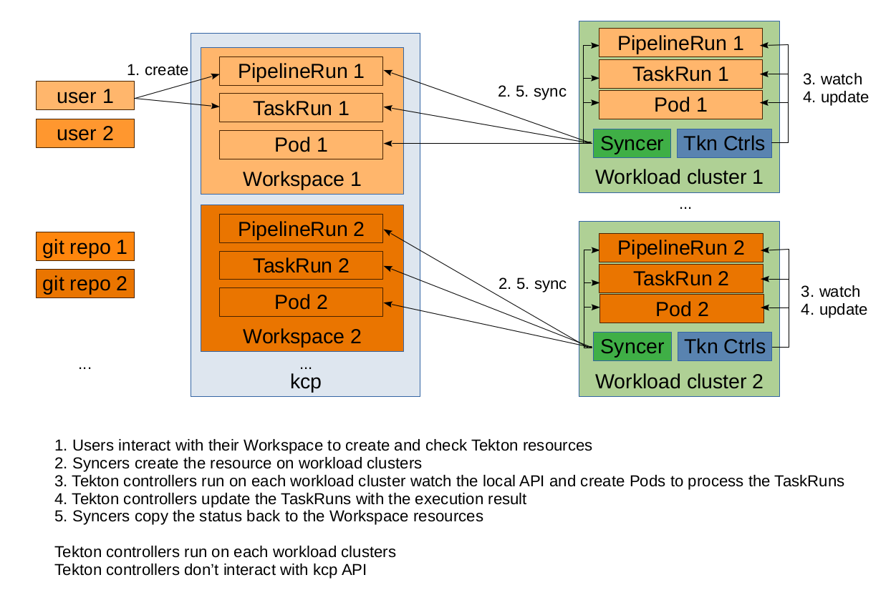

# Phase 1

## Description
In the first phase, Pipeline Service will leverage kcp Transparent-Multi-Cluster capabilities. Tekton and other controllers run directly on Kubernetes workload clusters and process the resources there. kcp syncer ensures that resources (Pipelines, PipelineRuns, etc.) created by users in their workspace are synced onto a workload cluster and the result of the processing is reflected to the user workspace.

This approach has the great advantage of not requiring any change to the controllers.

Controllers know nothing about kcp.

**Demos**

User (~3:30 min)

Platform installation (~4 min)

## Limitations

### ServiceAccount used by PipelineRuns

The `default` SA in kcp workspace has the secret containing its token synchronised in the workload cluster but under a different name (with `kcp` prefix). In phase 1 we don't want Tekton pods to communicate with the kcp API. As such they should not use an SA and its token created by kcp. This is a limitation but an existing SA from the workload cluster can be used instead.

#### Instructions

When you create a PipelineRun you have the following options:

* Not specifying an SA is valid
* The `pipeline` SA can be used
* The `default` SA does not work as it would point to the KCP API
* A custom SA created in kcp workspace may have the same flaw for our phase 1 approach

### Pruning of PipelineRuns and TaskRuns

The OpenShift Pipelines Operator has a default setup for a pruner that uses a `CronJob` to remove completed PipelineRuns and TaskRuns. Whenever a synced resource (i.e., PipelineRun or TaskRun) is removed from the workload cluster by the pruning mechanism, the kcp syncer recreates it during the workspace / workload cluster reconciliation. There is presently no means to sync the deletion back to the kcp workspace. To address this issue, the pruner is adjusted to remove only TaskRuns from the workload cluster, and the kcp syncer is configured to only sync PipelineRuns from kcp workspaces into the workload cluster. The TaskRun API is then not available at the workspace level.

#### Instructions

* PipelineRuns in the workload cluster must not be pruned. In order to ensure that they are correctly destroyed and not reconciled, prune them from the kcp workspace if necessary.
* To remove resources from the kcp workspace, there is no automatic pruner in place; this must be done manually.
