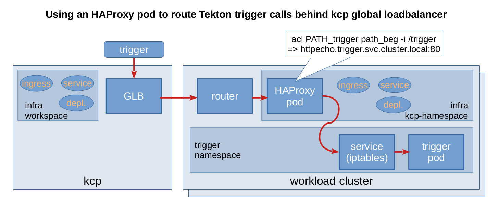

# Gateway for Tekton triggers

Leveraging kcp, workload clusters are an infrastructure that end users may not be aware of and not allowed to access directly.
With the approach described for [phase 1](../README.md#phase-1) controllers are directly running on these workload clusters.

This introduces a challenge. For trigger integration, external systems or users need to send requests to the listeners on the workload cluster.
The approach taken for addressing it is to introduce a gateway (an haproxy container) that forwards the requests to listeners part of the workload cluster infrastructure.

## Architecture

- GLB is kcp global load balancer. This is a work in progress. Currently a development version is based on an ingress-controller that automatically configures an envoy proxy.
- Ingress, Service, Deployment and ConfigMap for the HAProxy based gateway are created in kcp, which syncs them onto the workload clusters.

The request flow is as follows:
1. An external system, GitHub for instance, triggers an http call.
2. The GLB forwards the call to the ingress router running on a workload cluster.
3. The ingress router forwards the call to its backend the HAProxy container.
4. HAProxy uses path-based routing to forward `/trigger` requests to the trigger Service in the trigger namespace.
5. The Service, implemented through iptables rules most of the time, forwards the packets to the trigger pod.
6. The trigger pod processes the request.

## Installation

Kubectl should point to your kcp organisation.

~~~
kubectl kcp workspace create infra --enter
kubectl create -f ./gitops/triggers/gateway/haproxy-cfg-cm.yaml
kubectl create -f ./gitops/triggers/gateway/haproxy-deployment.yaml
kubectl create -f ./gitops/triggers/gateway/haproxy-service.yaml
kubectl create -f ./gitops/triggers/gateway/haproxy-ingress.yaml
~~~

HAProxy configuration can be amended through the ConfigMap. See the section below.

## Configuration

Connection settings, support for https can be configured by amending the HAProxy configuration contained in the ConfigMap.
This will get streamlined with the automation of the installation of Tekton triggers.

The first use case for the gateway is to forward requests to the listeners of Tekton triggers. This may also be used to proxy other services.
Therefore, additional frontends can be configured so that queries with other paths are forwarded to other backend servers.

Path-based routing is configured in this snippet:

~~~
acl PATH_trigger path_beg -i /trigger
use_backend be_trigger if PATH_trigger
~~~

The backend in charge of processing the query can be specified in the referenced section:

~~~
server s1 httpecho.trigger.svc.cluster.local:80
~~~
here the backend is the service `httpecho` in the `trigger` namespace listening to port 80.

## Demo

**Demo** (3mns)

---
**_NOTE:_**  This is only needed for phase 1. This component will get removed when we move to phase 2 and have the event listeners provisioned through kcp.

---

