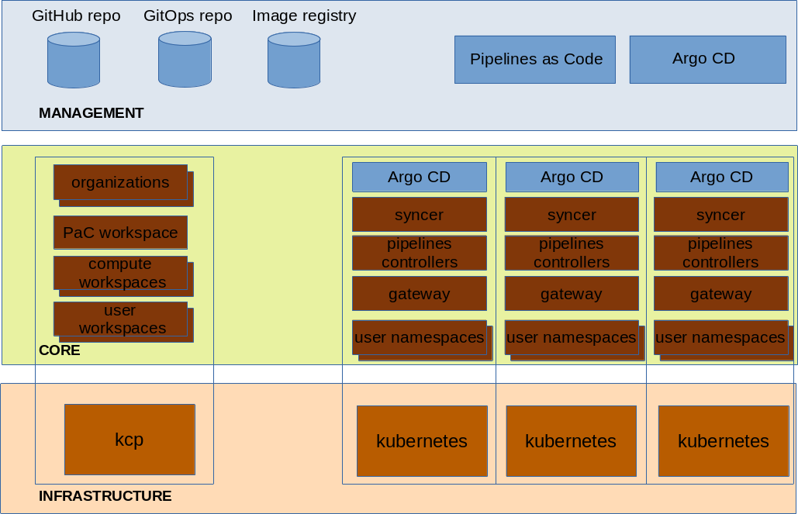

# Pipeline Service operations

## Introduction

The aim of this document is to introduce various considerations, processes and tasks required for operating Pipeline Service.
The primary audience are teams willing to deploy and operate Pipeline Service.
The scope is focused on the operational aspects. This document does not go into the details of the implementation as far as it is not required from an operational point of view.

## Components

**Phase 1**

### Management

The components of the management layer are prerequisites for the automation and the deployment of the Pipeline Service platform.

#### GitHub repository

This is the repository where the document you are reading and the components for automating the deployment and operation of Pipeline Service are made available and maintained.

#### GitOps repository

The GitOps repository contains the files providing the intended state and configuration of a Pipeline Service installation.

A separate document will be created to present the directory structure and the possible approaches for customization.

#### Image repository

Pipelines as Code uses PipelineRuns for automation. An online or offline repository needs to serve the images for the Tasks of the PipelineRuns.

#### Argo CD

Pipeline Service takes a GitOps approach and leverages Argo CD for the purpose. With phase 1, an in-cluster management approach is taken. A separate instance of Argo CD runs on every compute cluster and the interaction with Argo CD is done through the kubernetes API of the cluster.

### Infrastructure

The infrastructure components are not directly managed by the Pipeline Service platform. The Pipeline Service relies however on their availability. They may get managed by the same or a different team depending on the company size and organization.

#### kcp

kcp allows decoupling the control plane and compute. It brings better multi-tenancy and greater scalability.
End users interact with Pipeline Service through their kcp workspace or a layered product on top of it. They don't need to interact with any of the lower layer components.

#### Compute clusters

Compute clusters are traditional OpenShift clusters (till now tests and automation have been done with OpenShift but other Kubernetes distributions will be added later on). Once registered to kcp they bring the compute power necessary for delivering the service and processing user requests like PipelineRuns.

### Core

#### Syncer

The syncer is a kcp component in charge of synchronizing resources, e.g. Pipelines and PipelineRuns for our purpose, between kcp workspaces and the underlying compute clusters. Although the syncer is a kcp component its deployment and management is performed by the Pipeline Service platform.

#### Pipelines Controllers

The Pipelines Controllers are traditional Kubernetes operators. They are in charge of aligning the cluster state with the user intent carried by Pipelines resources, e.g. creating Pods for processing PipelineRuns. With Phase 1 they are directly installed on the compute clusters and only talk to the API of the cluster they are running on.

#### Gateway

The gateway is a component that allows Pipelines as Code integration and ensures that Git events sent to kcp global load balancer get routed to the Pipelines as Code event listeners running on the compute clusters.

*more components may get added in the future*

## Personas and responsibilities

### SRE team for Pipeline Service

 The SRE team for Pipeline Service is responsible for deploying and managing Pipeline Service on one or more KCP instances. This team may not be in charge of managing the kcp cluster (out of scope of this project) but is in charge of creating workspaces, the content necessary for running Pipeline Service and associated RBAC. The team is also in charge of managing the addition of compute clusters to the Pipeline Service platform and of managing the lifecycle of the components running on them.

### SRE team for OpenShift (other Kubernetes distributions to be added later on) clusters

The SRE team for OpenShift clusters is responsible for managing traditional OpenShift clusters (till now tests and automation have been done with OpenShift but other Kubernetes distributions will be added later on) independent of whether these clusters are running on premise or in the cloud.

### SRE team for kcp clusters

The SRE team for kcp clusters is responsible for managing kcp as a IaaS independent of whether the underlying servers are on premise or in the cloud.

### SRE team for layered products

Pipeline Service may get integrated in a layered product to offer a user experience tailored for specific scenarios. These layered products may have a dedicated SRE team for managing their operations.

### End users

End users may interact through layered products or directly with the kcp workspaces offered by Pipeline Service.

### Pipeline Service development community

This is the community developing this platform for automating the deployment and management of a highly scalable Pipeline Service.

## Lifecycle management

### Installation

To be added.

### User management / RBAC

#### Onboarding of a new tenant

To be added.

#### Granting and revoking access to users

To be added.

### Capacity management

#### Adding and removing compute clusters

To be added.

#### Quotas

To be added.

#### Resource pools

To be added.

## Event management / monitoring

To be added.

## Indicent handling

### Common scenarios

To be added.

### Troubleshooting

To be added.

## Backup and disaster recovery

To be added.

## Decommissioning

To be added.
